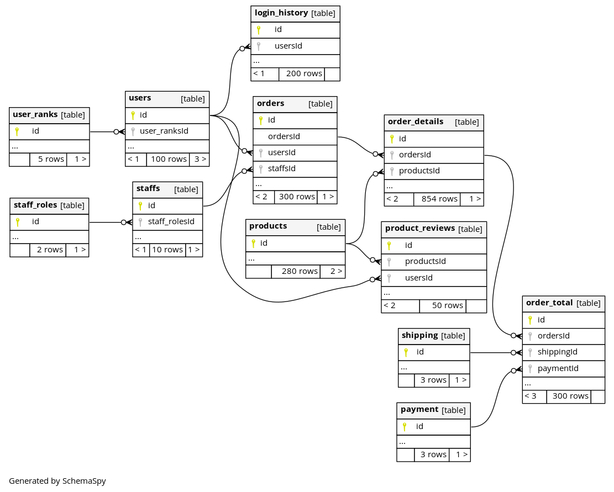

# DB構築 ER図作成

DB構築(DDL)をER図でチェックする。

- マイグレーションツール phpmig を使いDDLを記述
- Fakerを利用しダミーデータを投入
- 正規化できているか
- 外部キーは適切に設定されているか
- INDEXは適切に設定されているか
- schemaspyを利用しブラウザからヴィジュアルで確認できるようにする
    - 定義書
    - ER図

**Example Create Table**

```injectablephp
<?php
use Phpmig\Migration\Migration;

class createStaffRoles extends Migration
{
    /**
     * Do the migration
     */
    public function up()
    {
        $sql = "
        CREATE TABLE " . TABLE_STAFF_ROLES . " (
            `id` integer(11) NOT NULL AUTO_INCREMENT,
            `name` varchar(50) NOT NULL,
            `memo` varchar(255) NOT NULL,
            `delete_flg` boolean NOT NULL DEFAULT false,
            `created_at` datetime DEFAULT CURRENT_TIMESTAMP(),
            `updated_at` datetime DEFAULT CURRENT_TIMESTAMP(),
            PRIMARY KEY (`id`)
            ) ENGINE=InnoDB;
            ";
        $container = $this->getContainer();
        $container['db']->query($sql);
    }

    /**
     * Undo the migration
     */
    public function down()
    {
        $sql = "
        DROP TABLE " . TABLE_STAFF_ROLES . "
        ";
        $container = $this->getContainer();
        $container['db']->query($sql);
    }
}
```

**Example Insert Data**

```injectablephp
<?php

use Phpmig\Migration\Migration;

class insertStaffRoles extends Migration
{
    /**
     * Do the migration
     */
    public function up()
    {
        $faker = Faker\Factory::create(FAKER_LOCATE);
        $container = $this->getContainer();
        $staff_roles_array = STAFF_ROLES_ARRAY;

        for ($i = 0; $i < sizeof($staff_roles_array); $i++) {
            $stmt = $container['db']->prepare(
                "insert into " . TABLE_STAFF_ROLES . "
               (
                   name,
                   memo
               ) values (
                '" . $staff_roles_array[$i] . "',
                '" . $faker->realText(50) . "'
                );"
            );
            $stmt->execute([]);
        }
    }

    /**
     * Undo the migration
     */
    public function down()
    {
        $sql = "
        TRUNCATE TABLE " . TABLE_STAFF_ROLES . "
        ";
        $container = $this->getContainer();
        $container['db']->query($sql);
    }
}
```

**ER図 ( Schemaspy )**


<!-- @import "[TOC]" {cmd="toc" depthFrom=2 depthTo=6 orderedList=false} -->

<!-- code_chunk_output -->

- [コマンド](#コマンド)
- [DB構築 ER図作成](#db構築-er図作成)
    - [コマンド](#コマンド)
    - [Facker](#facker)
        - [Personal](#personal)
        - [Company](#company)
        - [DateTime](#datetime)
        - [Internet](#internet)
        - [Payment](#payment)
        - [coor](#coor)
        - [File format](#file-format)
        - [画像フォーマット](#画像フォーマット)
        - [Miscellaneous](#miscellaneous)
        - [Uuid](#uuid)
        - [HtmlLorem](#htmllorem)
    - [Schemaspy](#schemaspy)
        - [コマンド](#コマンド-1)
    - [PHP-CS-FIXER](#php-cs-fixer)

<!-- /code_chunk_output -->

### コマンド

```bash
#  migrationファイル作成
vendor/bin/phpmig generate
docker-compose exec phpmig vendor/bin/phpmig generate
# status
vendor/bin/phpmig status
docker-compose exec phpmig vendor/bin/phpmig status
# Migrate
vendor/bin/phpmig migrate
docker-compose exec phpmig vendor/bin/phpmig migrate
# Rollback
## 1つ戻す 
vendor/bin/phpmig rollback
docker-compose exec phpmig vendor/bin/phpmig mrollbackkk
## 指定したところまで戻す 
vendor/bin/phpmig rollback -t 20111101000144
docker-compose exec phpmig vendor/bin/phpmig rollback -t 20111101000144
### 全て戻す
vendor/bin/phpmig rollback -t 0
docker-compose exec phpmig vendor/bin/phpmig rollback -t 0
###指定したところを戻す
vendor/bin/phpmig phpmig down 20111101000144
docker-compose exec phpmig vendor/bin/phpmig down 20111101000144
```

[ docker-compose exec phpmig ](https://github.com/davedevelopment/phpmig)

## Facker

```bash
#  !nstall
composer require fzaninotto/faker
```

```bash
require_once 'vendor/autoload.php';
$faker = Faker\Factory::create('ja_JP');
```

| 用途                    | code                                                                |
|-----------------------|---------------------------------------------------------------------|
| randomDigit           | $faker->randomDigit                                                 |
| 桁指定のランダム番号            | $faker->randomNumber($nbDigits = 4, $strict = false)                |
| 少数                    | $faker->randomFloat($nbMaxDecimals = NULL, $min = 0, $max = 100)    |
| 範囲指定                  | $faker->numberBetween($min = 1000, $max = 9000)                     |
| 範囲指定                  | $faker->numberBetween(1, 5)                                         |
| 配列内から指定数の値を取得         | $faker->randomElements($array = ['red','blue','white'], $count = 2) |
| 配列から値を一つ取得            | $faker->randomElement($array = ['red','blue','white'])              |
| ランダムな値を埋める            | $faker->numerify('Hello ###')                                       |
| ランダムな文字を埋める           | $faker->lexify('Hello ???')                                         |
| 正規表現                  | $faker->regexify('[A-Z0-9._%+-]+@[A-Z0-9.-]+\.[A-Z]{2,4}')          |
| sentence (en)         | $faker->sentence($nbWords = 6, $variableNbWords = true)             |
| paragraph (en)        | $faker->paragraph($nbSentences = 3, $variableNbSentences = true)    |
| text (en)             | $faker->text($maxNbChars = 100)                                     |
| text (jp)             | $faker->realText(100)                                               |

### Personal

| 用途                    | code                                                                |
|-----------------------|---------------------------------------------------------------------|
| name                  | $faker->name                                                        |
| FirstName             | $faker->firstName                                                   |
| LastName              | $faker->lastName                                                    |
| FirstName (Male)      | $faker->firstNameMale                                               |
| LastName  (Female)    | $faker->lastNameFemale                                              |
| FirstKanaName         | $faker->firstKanaName                                               |
| LastKanaName          | $faker->lastKanaName                                                |
| FirstKanaName (Male)  | $faker->firstKanaNameMale                                           |
| LastKanaName (Female) | $faker->lastKanaNameFemale                                          |
| Email                 | $faker->email                                                       |
| Email                 | $faker->safeEmail                                                   |
| Email                 | $faker->freeEmail                                                   |
| Email                 | $faker->companyEmail                                                |
| Domain                | $faker->freeEmailDomain                                             |
| Domain                | $faker->safeEmailDomain                                             |
| 国名                    | $faker->country                                                     |
| Postcode (7桁)         | $faker->postcode                                                    |
| Postcode1 (3桁)        | $faker->postcode1                                                   |
| Postcode2 (4桁)        | $faker->postcode2                                                   |
| 住所 (郵便番号 住所)          | $faker->address                                                     |
| 都道府県                  | $faker->prefecture                                                  |
| 市区町村                  | $faker->ward . $faker->city                                         |
| その他の住所                | $faker->streetAddress . $faker->secondaryAddress                    |
| 緯度・経度                 | $faker->latitude $faker->longitude                                  |
| 電話番号                  | $faker->phoneNumber                                                 |
| 電話番号 (国際規格)           | $faker->e164PhoneNumber                                             |
| 誕生日                   | $faker->dateTimeBetween('-80 years', '-20years')->format('Y-m-d')   |
| 日本語テキスト               | $faker->realText(30)                                                |

### Company

| 用途                    | code                                                                |
|-----------------------|---------------------------------------------------------------------|
| 会社名                   | $faker->company                                                     |
| 会社名 (Prefix)          | $faker->companyPrefix                                               |
| 会社名 (Suffix)          | $faker->companySuffix                                               |
| jobTitle              | $faker->jobTitle                                                    |

### DateTime

| 用途                    | code                                                                |
|-----------------------|---------------------------------------------------------------------|
| timezone              | $faker->timezone                                                    |
| unixTime              | $faker->unixTime                                                    |
| dateTime              | $faker->dateTime($max = 'now', $timezone = null)                    |
| date                  | $faker->date($format = 'Y-m-d', $max = 'now')                       |
| year                  | $faker->year                                                        |
| month                 | $faker->month                                                       |
| monthName             | $faker->monthName                                                   |
| dayOfMonth            | $faker->dayOfMonth($max = 'now')                                    |
| dayOfWeek             | $faker->dayOfWeek($max = 'now')                                     |
| amPm                  | $faker->amPm                                                        |
| time                  | $faker->time($format = 'H:i:s', $max = 'now')                       |
| top of domain         | $faker->tld                                                         |

### Internet

| 用途                    | code                                                                |
|-----------------------|---------------------------------------------------------------------|
| url                   | $faker->url                                                         |
| ipv4                  | $faker->ipv4                                                        |
| ipv6                  | $faker->ipv6                                                        |
| localIpv4             | $faker->localIpv4                                                   |
| macAssress            | $faker->macAddress                                                  |
| domainName            | $faker->domainName                                                  |
| userAgent             | $faker->userAgent                                                   |
| - chrome              | $faker->chrome                                                      |
| - firefox             | $faker->firefox                                                     |
| - safari              | $faker->safari                                                      |
| - opera               | $faker->opera                                                       |
| - internetExplorer    | $faker->internetExplorer                                            |

### Payment

| 用途                             | code                                   |
|--------------------------------|----------------------------------------|
| creditCardType                 | $faker->creditCardType                 | 
| creditCardNumber               | $faker->creditCardNumber               | 
| creditCardExpirationDateString | $faker->creditCardExpirationDateString | 
| creditCardDetails              | $faker->creditCardDetail               | 

### coor

| 用途            | code                  |
|---------------|-----------------------|
| hexcolor      | $faker->hexcolor      |
| rgbcolor      | $faker->rgbcolor      |
| rgbCssColor   | $faker->rgbCssColor   |
| safeColorName | $faker->safeColorName |
| colorName     | $faker->colorNam      |

### File format

| 用途            | code                  |
|---------------|-----------------------|
| fileExtension | $faker->fileExtension |
| mimeType      | $faker->mimeTyp       |

### 画像フォーマット

| 用途       | code                                                                     | Example                                          |
|----------|--------------------------------------------------------------------------|--------------------------------------------------|
| imageUrl | $faker->imageUrl($width = '400', $height = '200', 'cats', true, 'Faker') | https://lorempixel.com/400/200/cats/Faker/?25164 |
| image    | $faker->image($dir = '/tmp')                                             | /tmp/f234f5e7e9c27ec90bf1c89ac6935cfe.jpg        |
| image2   | $faker->image($dir, $width, $height, 'cats', false                       | 1ac870f44ad086a9d3c63bf14087e2b0.jpg             |

### Miscellaneous

| 用途           | code                 | Example                                                          |
|--------------|----------------------|------------------------------------------------------------------|
| md5          | $faker->md5          | 1f79fab8a88d67d83066622ed86da5a7                                 |
| sha1         | $faker->sha1         | 73bdebd529e19925813f3925e58077e9db430a72                         |
| sha256       | $faker->sha256       | 3f388d2654657b9a7ecd8493b96624094b187676457e659b076d11084a4fcf87 |
| locale       | $faker->locale       | af_ZA                                                            |
| countryCode  | $faker->countryCode  | TH                                                               |
| languageCode | $faker->languageCode | bm                                                               |
| currencyCode | $faker->currencyCode | CZK                                                              |
| emoji        | $faker->emoj         | 😥                                                               | 

### Uuid

| 用途   | code                    | example                                                                                                                                                                                                                                                                                                                                                  |
|------|-------------------------|----------------------------------------------------------------------------------------------------------------------------------------------------------------------------------------------------------------------------------------------------------------------------------------------------------------------------------------------------------|
| html | $faker->randomHtml(2,3) | `<html><head><title>Enim ut dolores maiores et.</title></head><body><form action="example.com" method="POST"><label for="username">facilis</label><input type="text" id="username"><label for="password">qui</label><input type="password" id="password"></form><b>Perferendis dolorum architecto dolores dolor perferendis expedita.</b></body></html>` |

### HtmlLorem

| 用途   | code         | example                              |
|------|--------------|--------------------------------------|
| uuid | $faker->uuid | 93d1053a-cd80-3c61-b78e-f5a0152c2ecf |

## Schemaspy

### コマンド

```bash
# Document生成
docker-compose run schemaspy
```

## PHP-CS-FIXER

```bash
docker-compose exec phpmig vendor/bin/php-cs-fixer fix --dry-run 
docker-compose exec phpmig vendor/bin/php-cs-fixer fix --dry-run --diff 
docker-compose exec phpmig vendor/bin/php-cs-fixer fix 
```